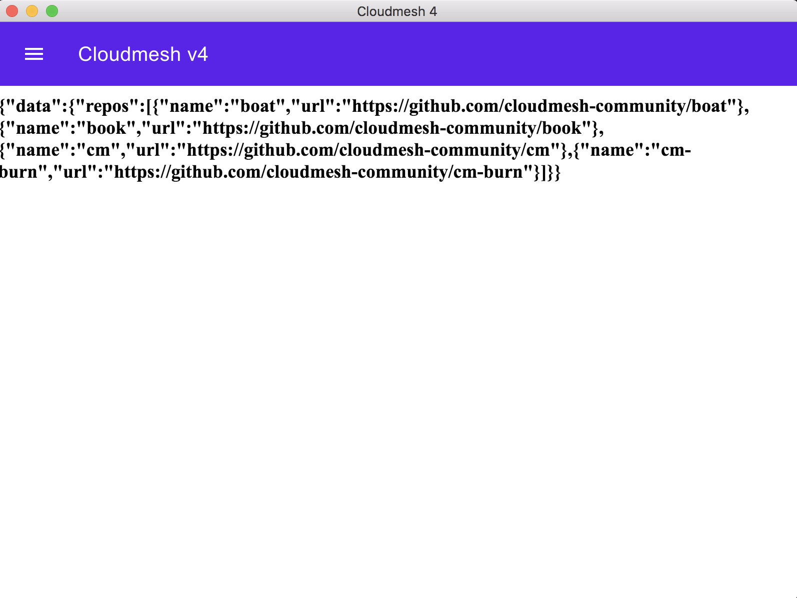

# Cloudmesh App #

This is project for Cloudmesh GUI using electronjs and backend using graphql-django-python.

## Quick start

This app consists for two sub modules

* app - A cross-platform electronJS app which will be distributed to users
* server - The GraphQL server for app to get data. This server will run on cloud.

## Development

Below steps needs to be performed to setup development environment

### Setup Server

To setup server execute following commands after cloning repository

```bash
cd project-code/server
python3 -m venv venv
source venv/bin/activate
pip3 install django==2.0.2 graphene==2.0.1 graphene-django==2.0.0 django-filter==1.1.0 django-graphql-jwt==0.1.5
python manage.py migrate
python manage.py runserver
```

To put some data in server execute following commands

```bash
python manage.py shell
```

It will open python shell, execute following commands in python shell

```python
from repos.models import Repo
Repo.objects.create(name="boat",full_name="cloudmesh-community/boat",url="https://github.com/cloudmesh-community/boat",description="S.T.A.R. boat")
Repo.objects.create(name="book",full_name="cloudmesh-community/book",url="https://github.com/cloudmesh-community/book",description="Gregor von Laszewski")
Repo.objects.create(name="cm",full_name="cloudmesh-community/cm",url="https://github.com/cloudmesh-community/cm",description="Cloudmesh v4")
Repo.objects.create(name="cm-burn",full_name="cloudmesh-community/cm-burn",url="https://github.com/cloudmesh-community/cm-burn",description="Burns many SD cards so we can build a Raspberry PI cluster")
exit()
```

Then start server again

```bash
python manage.py runserver
```

### Setup App

To set up UI project execute following commands after cloning repository

```bash
cd project-code/app
npm install
npm run build
```

For development purpose app assumes that server is running on following URL

* http://localhost:8000/graphql/

start app using

```bash
npm start
```

It will open up an application where you will see title and data it got from python server.

<kbd></kbd>
