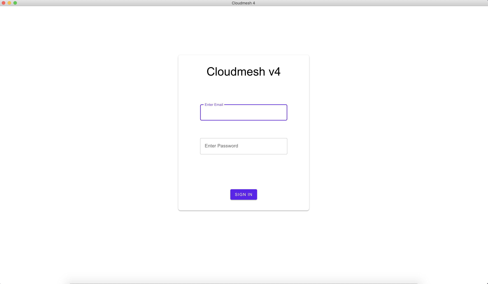

# Cloudmesh GraphQL App :smiley: fa18-516-21 and fa18-516-02

| Mihir Shanishchara, Vineet Barshikar
| mshanish@iu.edu, vbarshik@indiana.edu
| Indiana University
| hid: fa18-516-21 fa18-516-02
| github: [:cloud:](https://github.com/cloudmesh-community/fa18-516-21/blob/master/project-paper/report.md)
| code: [:cloud:](https://github.com/cloudmesh-community/graphql)

---

Keywords: GraphQL, Cloudmesh client, mongoengine, Flask, Electron

---

## Abstract

Cloudmesh cm4 is an ongoing project worked upon by entire class to create a 
network of computers that can run parallel jobs. Currently it accepts commands 
via command line. Our project provides an user interface to Cloudmesh cm4. 
We implemented a client-server application which will communicate through 
GraphQL APIs.

## Introduction

Our aim with this project was to learn GraphQL and gain deep understanding 
into how effectively it can be used in place of Rest APIs. Along with this 
we also wanted to contribute to ongoing Cloudmesh cm4 project. Currently cm4
accepts commands via command line. And thats when we realized that we could 
use GraphQL and create a user interface which would translate user actions 
into cm4 commands and in turn execute those commands. 

Our project has pages for both list of Virtual Machines and list of Images.
User can start, restart, shutdown any VM or image. They can also mark them 
as their favorites so that they appear at the top for them.

We have implemented lazy loading or infinite scrolling due to which 
irrespective of how big the list of Virtual Machines or Images be, it loads 
them in batches which improves page rendering performance.

More info about GraphQL is available as a chapter in the cloud computing 
handbook.	

## Requirements

* A cross platform desktop application which can be reditributed to users
* Client App should show data from MongoDB using GraphQL APIs
* Client App should send user action to server and mutate data
* Client and server should be able to handle more than 10000 VMs 

## Architecture

+@fig:graphqlapparchitecture shows architecture of Cloudmesh GraphQL app.

{#fig:graphqlapparchitecture}

Cloudmesh App is divided in two parts

* *Client App*: Client app can be distributed to the users. This app will 
  provide a simple interface to the user, using which user can execute all 
  commands provided by cm4. Client app will communicate with GraphQL server 
  and based on input from the user, server will execute commands.

* *GraphQL server*: This GraphQL server will be running on one cloud 
  instance to which all client apps can connect.

Client App is designed using following technologies

* ElectronJS [@electronjs] : Using ElectronJS we can build cross platform 
  desktop apps with JavaScript, HTML and CSS. ElectronJS combines
  power of native apps with beautiful web interface.

* BackboneJS [@backbonejs] : BackboneJS provides an MVC structure with 
  models,collections and views. For code reusability views have been 
  divided in to two categories
  
  * Smart View: Knows how to communicate with server but doesn't know about 
    representation 
  * Dumb View: Doesn't know how to communicate with server but knows how to 
    render data

* HandlebarsJS [@handlebarsjs]: Handlebars provides set of functions which 
  lets us build generic HTML templates easily. It also provides a way to 
  extend helper function and create custom helpers to use in templates.
  * All custom helper functions for tempaltes are defined at utils/helpers 
    space

* jQuery [@jquery]: jQuery provides set of functions which are very useful
  for DOM manipulation

* Material UI [@materialui]: Material UI is open source design spec which is 
  mainly developed by Google. We are using web component implementation of
  Material UI.

* Webpack [@webpack]: Webpack is a module bundler and also it provides a way
  to specify loaders for different file types. For example handlebars loader
  is used to load and compile handlebar template before creating bundle.

GraphQL server is designed using following technologies

* Python 3 (Please refer the handbook for introduction)
  
* Flask (Please refer the handbook for introduction)

* Graphene (Please refere the handbook for introduction)
  
* Flask-GraphQL [@www-flask-graphql]: Flask-GraphQL adds support for GraphQL
  to the flask application.

* Graphene-Mongo [@graphene-mongo]: An integration of graphene and 
  mongoengine.

## Dataset

We used python's 3rd party library *faker*[@faker] to generate fake data 
for testing.

## Implementation

Please refer [README.md](https://github.com/cloudmesh-community/graphql/blob/master/README.md) available under project code to install and start app. 

+@fig:graphqlapplogin shows login page of app

{#fig:graphqlapplogin}

Since authentication is not requirement for this project and its already
implemented with GraphQL example in handbook, we have not implemented it
in project. On click of *Login* button user will see dashboard, which is 
empty as of now.

+@fig:graphqlappvmlist shows the view rendered on click of *VMs* button

{#fig:graphqlappvmlist}

Default view is card layout. You can switch to table layout using action 
available at the top-right corner. +@fig:graphqlappviewoptions shows available 
view options for the VM list

{#fig:graphqlappviewoptions}

App will list only first 40 VMs using query

```graphql
{
    query { 
        allAzures (first:40) { 
            edges { 
                node { 
                    host, 
                    name, 
                    region, 
                    image, 
                    state, 
                    isFavorite
                } 
            }, 
            pageInfo { 
                endCursor, 
                hasNextPage 
            } 
        } 
    }
}
```

On vertical scroll, the list will be updated with query

```graphql
{
    query { 
        allAzures (first: 40, after: \"YXJyYXljb25uZWN0aW9uOjM5\") { 
            edges { 
                cursor, 
                node { 
                    host,
                    name, 
                    region, 
                    publicIps, 
                    privateIps, 
                    image, 
                    state, 
                    isFavorite
                } 
            },  
            pageInfo { 
                endCursor, 
                hasNextPage 
            } 
        } 
    }
}
```

This way the app can load any number of VMs without any performance issue. 
Each vm has a set of actions assigned. You can start/stop, mark as favorite
or view details of VM. +@fig:graphqlappvmactions explains all the available 
actions for each VM in the list.

{#fig:graphqlappvmactions}

On click of *start vm* app will execute this mutation query

```graphql
mutation($cardAction:String!,$value:String!,$host:String!,$action:String!) { 
    updateAzure(host:$host, action:$action, actionDetail: $cardAction, value: $value) {
        azure { 
            state 
        } 
    } 
}
```
```json
{
    "variables": {
        "cardAction":"start",
        "action":"state",
        "host":"desktop-28.woods-porter.com",
        "value":"false"
    }
}
```

On click of *View Details* action the app will open pop-up and show VM 
details. +@fig:graphqlappvmdetails shows details view

{#fig:graphqlappvmdetails}

User can use *Sort By* dropdown menu available at the top-right corner to 
sort the VM list by host and name. When you sort a list it will also sort 
VMs by favorite flag. While implementing the app we found that graphene does 
not yet support sorting. So we created a query and used *order_by* function 
provided by mongo.

At any time you can switch cloud provider by just switching the tabs available 
at top.

*Update VM Data* button available at top-right corner, is used to load the data 
from cloudmesh and store it in mongo database. Right now integration with cm4 
is not implemented but faker will generate some fake data and store it in mongodb.

## Summary

### Sorting support

We observed that graphene-mongo does not have support for sorting. And after 
exploring a little more, we found that below GraphQL servers do support it

* expressjs-server
* Flask-SQLAlchemy
* Graphene-Django

We were able to find out a workaround but it is not a very convenient way. 
We had to write to multiple resolver functions for each sort function.

```python
    def resolve_sortAWSByHost(self, info, **args):
        return AwsModel.objects().order_by("-isFavorite", "host")

    def resolve_sortAzureByHost(self, info, **args):
        return AzureModel.objects().order_by("-isFavorite", "host")

    def resolve_sortAWSByName(self, info, **args):
        return AwsModel.objects().order_by("-isFavorite", "name")

    def resolve_sortAzureByName(self, info, **args):
        return AzureModel.objects().order_by("-isFavorite", "name")
```

### Indexing

Once we sorted the data, we observed huge performance degradation in data 
fetching. Hence it became necesarry for us apply correct indexing on mongodb.
We applied multiple indexes on the columns which we were using for sorting to
see some improvements.

```mongodb
collection_vm.create_index([("isFavorite", pymongo.DESCENDING)])
```

## Conclusion and future work 

Cloudmesh GraphQL App provides a very nice interface so it can be used by 
non-technical users as well. There are some performance bottlencks which we 
observerd for sorting, but it is not actually GraphQL issue because the sorting
function was provided by `mongoengine`. We think that after indexing and tweaking
some parameters for mongodb it can be improved but we haven't tried it. In future 
fake data generation can be just replaced with command like `cm4 vm list`. Or 
even better option would be to integrate cloudmesh inside app so that a 
standalone app can be distributed to users without need to install cm4 package.

Also from future implementation perspective GraphQL implementations in other
languages should be explored. While implementing the app we observed that some 
of the functions are not implemented by `Graphene`.

## Acknowledgement

We would like to thank Professor Gregor von Laszweski and TAs for their support and
guidance. 

## Workbreakdown

| Task                                               | Author |
|----------------------------------------------------|--------|
| Intial code setup with client server integration   | Mihir  |
| Integration of mongoengine                         | Vineet |
| Implementation of login page                       | Mihir  |
| Add routing between pages                          | Mihir  |
| Use Flask in server code                           | Vineet |
| GraphQL query to fetch VMs list                    | Vineet |
| Use Faker to generate mock VMs                     | Mihir  |
| GraphQL mutation to change VM state                | Vineet |
| Add Tabs for various VM types (AWS, Azure, etc.)   | Mihir  |
| Add variables for GraphQL APIs                     | Mihir  |
| Make mutations generic                             | Vineet |
| Make custom helper classes for Handlebar templates | Mihir  |
| Lazy loading (infinite scrolling on UI) of VMs     | Vineet |
| Mutation for set/unset Favorite VM                 | Vineet |
| Add code to show VM details                        | Mihir  |
| Add code to mimic DB update from cloudmesh data    | Mihir  |
| Add code to show notifications                     | Mihir  |
| Add helper to prettify JSON                        | Mihir  |
| Implement sort by dropdown and integrate with API  | Mihir  |
| Added table view to the list of VMs                | Vineet |
| Added sorting by IsFavorite and host               | Vineet |
| Implement image page to list image                 | Mihir  |
| Implement list all image APIs                      | Mihir  |